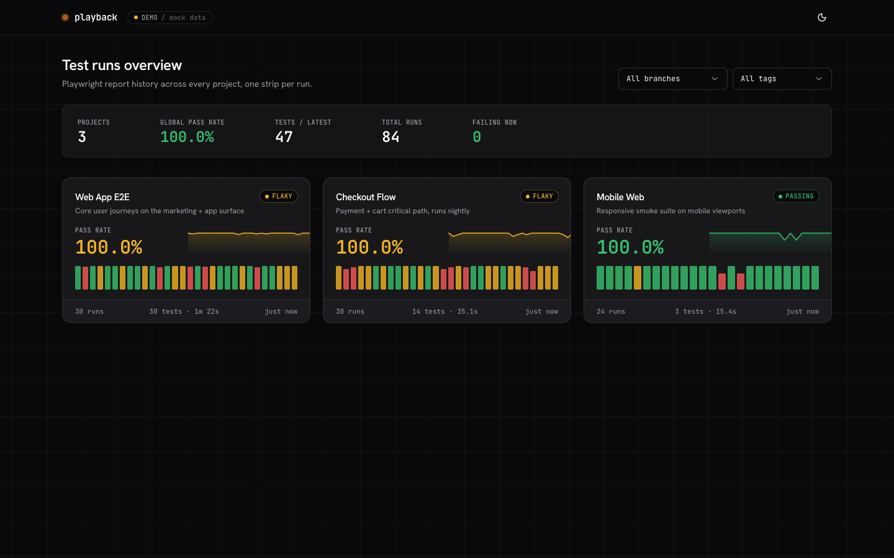
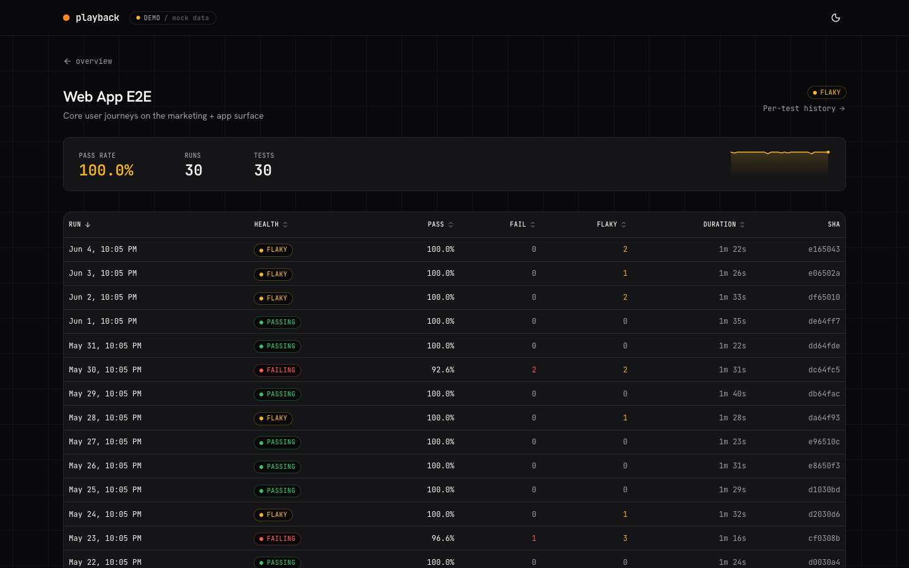
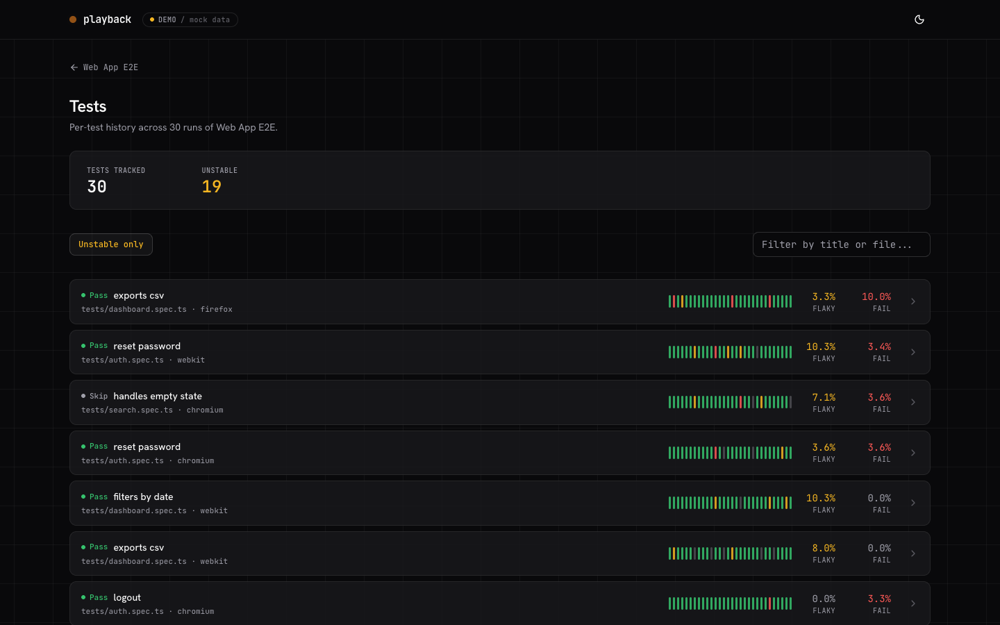
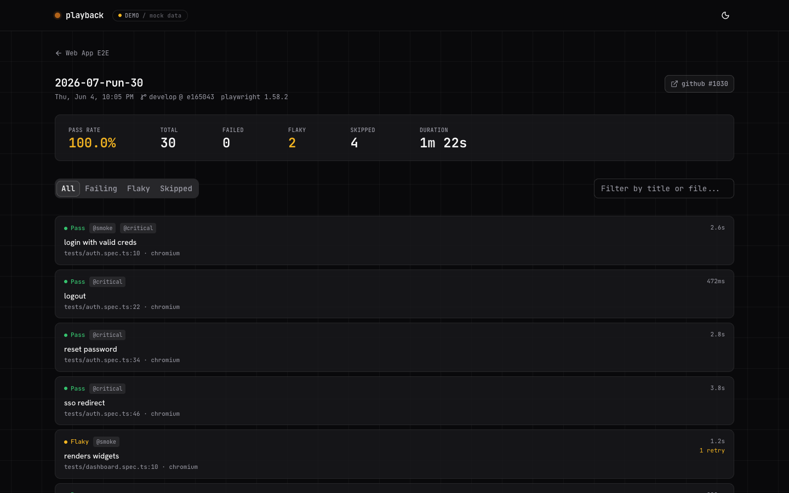
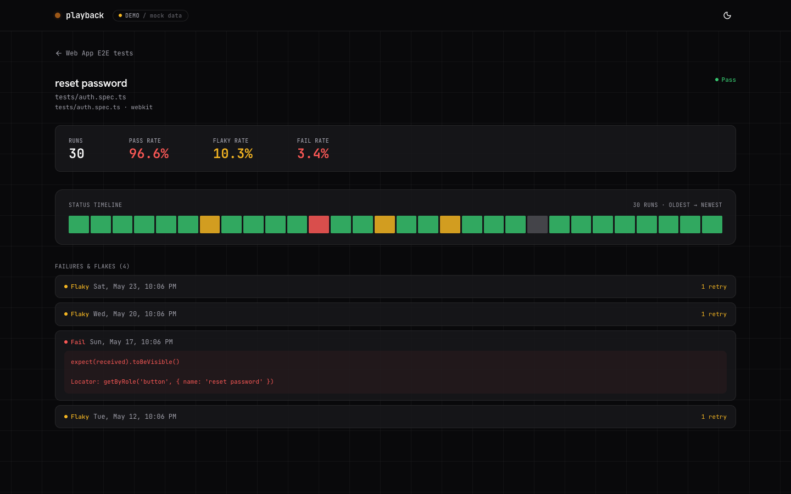

# playback

A dashboard for your Playwright reports, across projects and over time.

Playwright ships a great HTML report for a single run. `playback` sits one level up: it aggregates many runs into one place where you track pass rates, spot trends, and surface flaky tests over time. No backend - it's a static frontend that reads JSON you host anywhere.

<picture>
  <source media="(prefers-color-scheme: light)" srcset="docs/screenshots/overview-light.png">
  
</picture>

## Quick start

Try it with built-in demo data:

```bash
pnpm install
pnpm dev        # http://localhost:5173 - shows mock data
```

That's the full UI running on sample reports. To plug in your own, see [Use your own reports](#use-your-own-reports).

## Screenshots

<table>
<tr>
<td width="50%"><picture><source media="(prefers-color-scheme: light)" srcset="docs/screenshots/project-light.png"></picture><br><sub><b>Project</b> - run history with pass / fail / flaky per run</sub></td>
<td width="50%"><picture><source media="(prefers-color-scheme: light)" srcset="docs/screenshots/tests-light.png"></picture><br><sub><b>Tests</b> - per-test flake and fail rates</sub></td>
</tr>
<tr>
<td width="50%"><picture><source media="(prefers-color-scheme: light)" srcset="docs/screenshots/run-light.png"></picture><br><sub><b>Run</b> - every test in one run, filterable</sub></td>
<td width="50%"><picture><source media="(prefers-color-scheme: light)" srcset="docs/screenshots/test-history-light.png"></picture><br><sub><b>Test history</b> - one test across runs, with errors</sub></td>
</tr>
</table>

## Use your own reports

Three steps: generate data, host it, point the app at it.

### 1. Emit Playwright's JSON report

```ts
// playwright.config.ts
export default defineConfig({
  reporter: [['json', { outputFile: 'results.json' }]],
})
```

### 2. Ingest it with the CLI

`results.json` inlines attachments (screenshots, traces) as base64, which makes it heavy. The CLI strips those, writes a lightweight run report, and upserts a manifest:

```bash
pnpm ingest results.json --project web-app --name "Web App E2E"
```

Output lands in `playback-data/`:

- `manifest.json` - index of projects and runs
- `reports/web-app/<date>.json` - one file per run

Run it once per project per run; re-running the same `--run` replaces that entry.

### 3. Host the data, point the app at it

Upload `playback-data/**` to any static host (S3, GitHub Pages, nginx, a CDN). Then set `baseUrl` in [`packages/app/public/config.js`](packages/app/public/config.js):

```js
window.__PLAYBACK__ = {
  baseUrl: 'https://reports.example.com', // where manifest.json + reports/ live
  title: 'Playback',
}
```

Build and deploy the frontend:

```bash
pnpm build      # static output in packages/app/dist/
```

`config.js` is copied as-is into the build, so you can change `baseUrl` on the host without rebuilding.

## CLI reference

```bash
pnpm ingest <results.json> --project <id> [options]
```

```
--project <id>        required, stable slug per Playwright project
--name <name>         display name (defaults to id)
--run <id>            run id (defaults to report date, YYYY-MM-DD)
--out <dir>           output root (default: playback-data)
--git-sha / --git-branch
--ci-provider / --ci-run-url / --ci-run-number
```

Invoke as `pnpm ingest <args>`, `npx tsx packages/cli/src/playback.ts <args>`, or `playback <args>` once the CLI is installed.

CI example:

```bash
pnpm ingest results.json \
  --project web-app --name "Web App E2E" \
  --run "$GITHUB_RUN_ID" \
  --git-sha "$GITHUB_SHA" --git-branch "$GITHUB_REF_NAME" \
  --ci-provider github --ci-run-url "$GITHUB_SERVER_URL/$GITHUB_REPOSITORY/actions/runs/$GITHUB_RUN_ID"
# then upload ./playback-data/** to your static host
```

## Data source modes

The frontend reads data through one small interface, with two transports selected by `mode` in `config.js`. Same contract on both sides, so the UI is identical - only the transport differs.

**`static`** (default) - fetches files, zero backend:

```
GET {baseUrl}/manifest.json
GET {baseUrl}/reports/<project>/<run>.json
```

Per-test history is folded client-side (one fetch per run).

**`rest`** - fetches an API. Use when you outgrow static: huge manifests (paginate server-side), private reports (auth), or to skip downloading every run report just to build history.

```
GET {baseUrl}/api/manifest                           -> Manifest
GET {baseUrl}/api/projects/:projectId/runs/:runId     -> RunReport
GET {baseUrl}/api/projects/:projectId/tests           -> { project, histories }
```

Set `mode: 'rest'`. A dependency-free reference server (reads CLI output, computes history server-side) ships in [`examples/rest-server.ts`](examples/rest-server.ts):

```bash
pnpm ingest results.json --project web-app    # produce playback-data/
pnpm serve:rest playback-data 8787            # serve at http://localhost:8787/api
```

Build your own against those three endpoints; responses must satisfy the zod schemas in [`packages/core/src/contracts/playback.ts`](packages/core/src/contracts/playback.ts) (`manifestSchema`, `runReportSchema`, `projectHistorySchema`).

