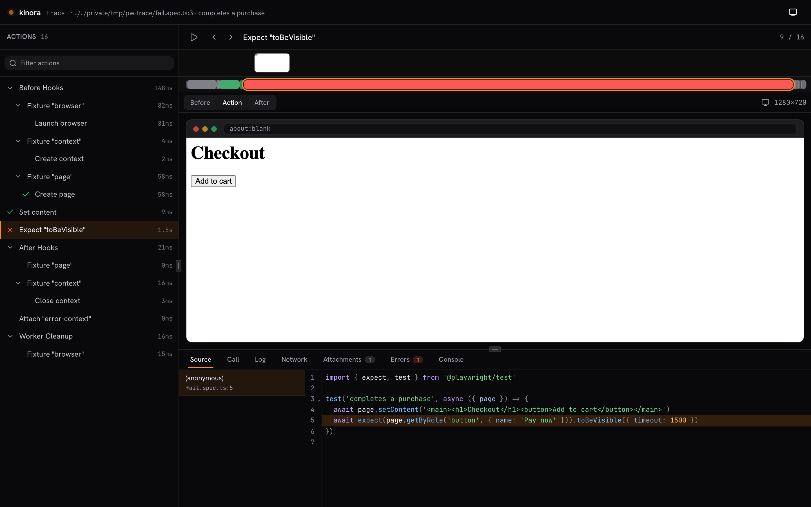
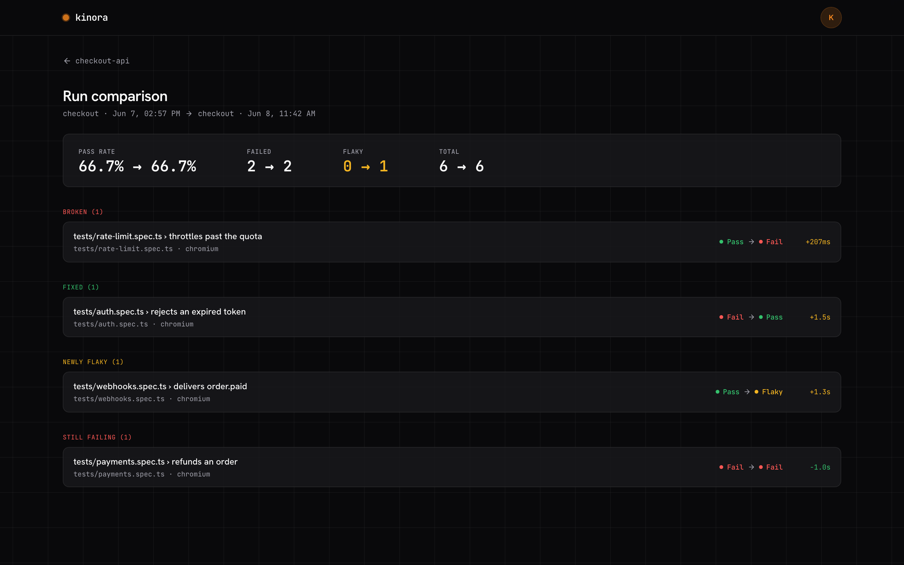

# kinora

A dashboard for your Playwright tests - across projects and over time - with an embedded trace viewer.

Playwright ships a great HTML report for a single run. kinora sits one level up: push every CI run to a kinora server and get one place to track pass rates, spot trends, and surface flaky tests over time. Failing tests get a **View trace** button that opens the full Playwright trace (DOM / timeline / network / console) right in the dashboard - no separate tooling.

> Status: in active development, pre-release.

<picture>
  <source media="(prefers-color-scheme: light)" srcset="docs/screenshots/overview-light.png">
  
</picture>

### Embedded trace viewer

Failing tests get a **View trace** button that opens the full Playwright trace inline - DOM, timeline, network, console - plus a **Copy prompt** to hand the failure to an LLM.

<picture>
  <source media="(prefers-color-scheme: light)" srcset="docs/screenshots/trace-viewer-light.png">
  
</picture>

### Run-to-run compare

Diff any two runs: newly failing, fixed, newly flaky, and still failing, grouped for you.

<picture>
  <source media="(prefers-color-scheme: light)" srcset="docs/screenshots/compare-light.png">
  
</picture>

## Packages

Monorepo (pnpm workspaces). Fair source: the deployable surface is FSL-1.1-MIT (source-available, converts to MIT after 2 years), the client libraries you embed are MIT.

| Package                                         | Role                                                                     | License     |
| ----------------------------------------------- | ------------------------------------------------------------------------ | ----------- |
| [`@kinora/server`](packages/server)             | Hono + tRPC API, better-auth, Drizzle/Postgres - ingest + dashboard data | FSL-1.1-MIT |
| [`@kinora/web`](packages/web)                   | Vue 3 dashboard (auth, runs, history, flakiness)                         | FSL-1.1-MIT |
| [`@kinora/trace-viewer`](packages/trace-viewer) | Vendored Playwright trace engine (Apache-2.0) + our Vue UI               | MIT         |
| [`@kinora/reporter`](packages/reporter)         | Playwright reporter - auto-uploads on `onEnd`                            | MIT         |
| [`@kinora/cli`](packages/cli)                   | Manual upload of a `results.json`                                        | MIT         |
| [`@kinora/core`](packages/core)                 | zod contracts + normalize + ingest client (shared)                       | MIT         |
| [`@kinora/ui`](packages/ui)                     | Shared shadcn-vue design system                                          | MIT         |

## Send your tests

### Reporter (recommended)

Auto-uploads at the end of every `playwright test` run. One line in your config:

```ts
// playwright.config.ts
export default defineConfig({
  reporter: [["@kinora/reporter", { project: { slug: "web-app" } }]],
  // enable tracing so View trace works
  use: { trace: "on-first-retry" },
});
```

Set the target + token via env (keep the token out of the config / in CI secrets):

```bash
KINORA_URL=https://your-kinora-server KINORA_TOKEN=<project-token> npx playwright test
```

### CLI (manual)

For setups without the reporter, or to upload an existing `results.json` from a separate CI job:

```bash
# playwright.config.ts: reporter: [['json', { outputFile: 'results.json' }]]
npx @kinora/cli upload results.json --project web-app \
  --url https://your-kinora-server --token <project-token>
# (or KINORA_URL / KINORA_TOKEN env)
```

Both paths share `@kinora/core` (same normalization + ingest client), so a test keeps a stable identity across runs and ingest methods.

## Development

Run the whole stack locally.

```bash
pnpm install

# 1. server + database
cd packages/server
cp .env.example .env
docker compose up -d            # Postgres on :5436
pnpm db:push                    # create tables
pnpm db:seed                    # seed a demo account + data, prints login + an API token
pnpm dev                        # server on :3000

# 2. web
cd packages/web
cp .env.example .env
pnpm dev                        # dashboard on :5173

# 3. trace viewer
pnpm dev:viewer                 # trace viewer on :5174
```

Open http://localhost:5173 and sign in with the seeded credentials (`demo@kinora.dev` / `password123`). Use the printed API token to push real runs from a project via the reporter or CLI.

Workspace scripts (from the root):

```bash
pnpm build        # build every package
pnpm typecheck    # vue-tsc / tsc across the workspace
pnpm lint         # eslint
pnpm test         # unit tests
pnpm test:e2e     # trace-viewer and web e2e (Playwright)
```

## Self-hosting

A single `docker compose` bundle (web + server + Postgres + S3-compatible storage) is planned. For now, the development setup above is the way to run it end to end.

## Licensing

kinora is fair source. The deployable product (`server`, `web`) is **FSL-1.1-MIT**: source-available, free to self-host, and each release converts to **MIT** on its second anniversary. The libraries you embed in your own test suite (`reporter`, `cli`, `core`, `ui`) and the trace viewer are **MIT**. The trace engine under `packages/trace-viewer/src/core` and `src/sw` is vendored from [microsoft/playwright](https://github.com/microsoft/playwright) (Apache-2.0).
